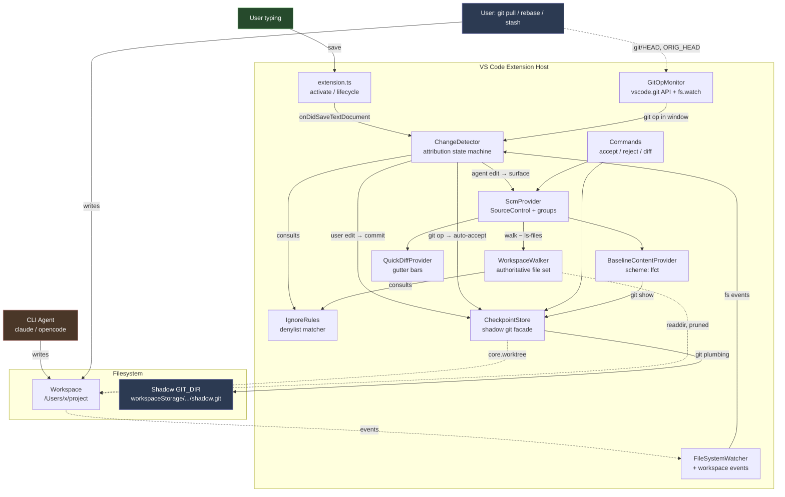
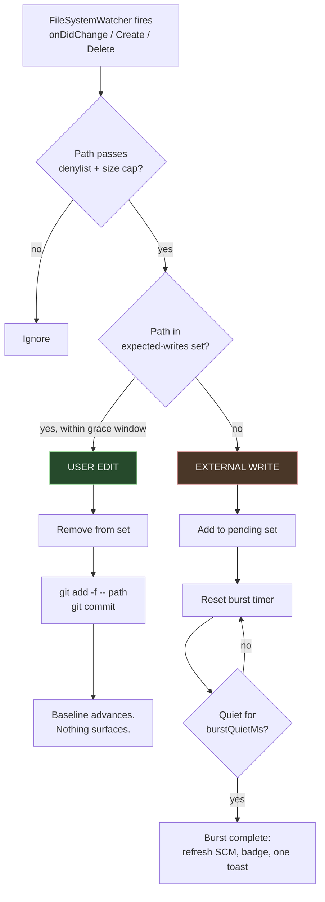
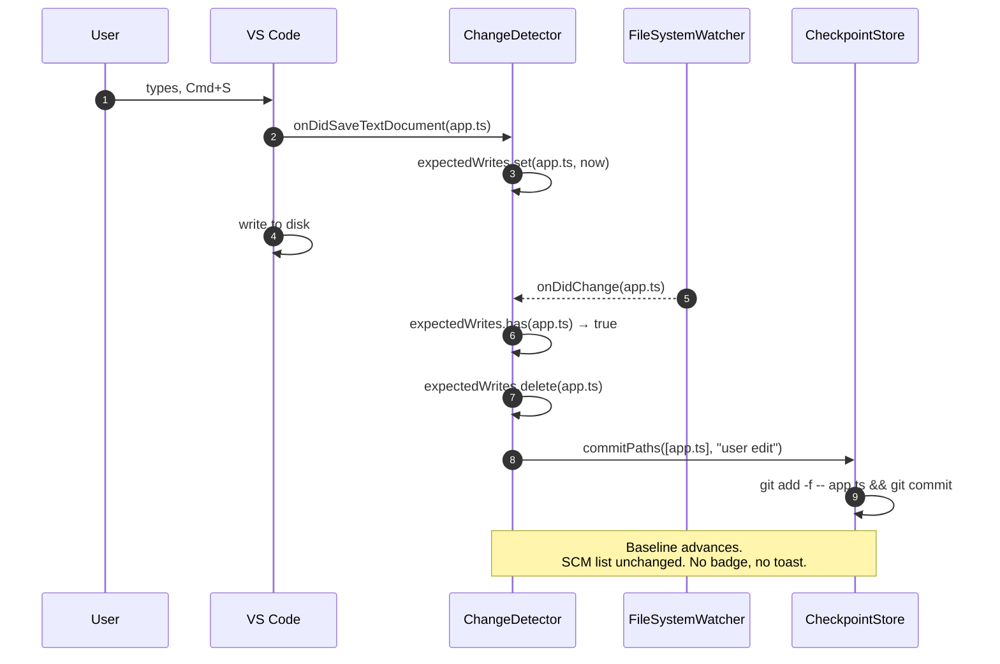
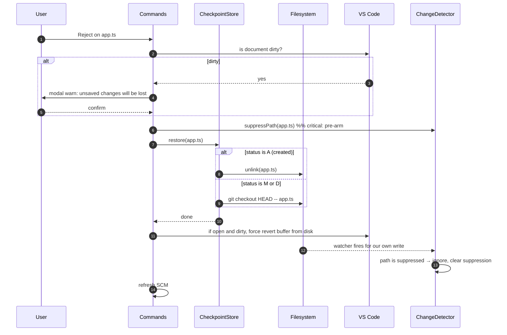
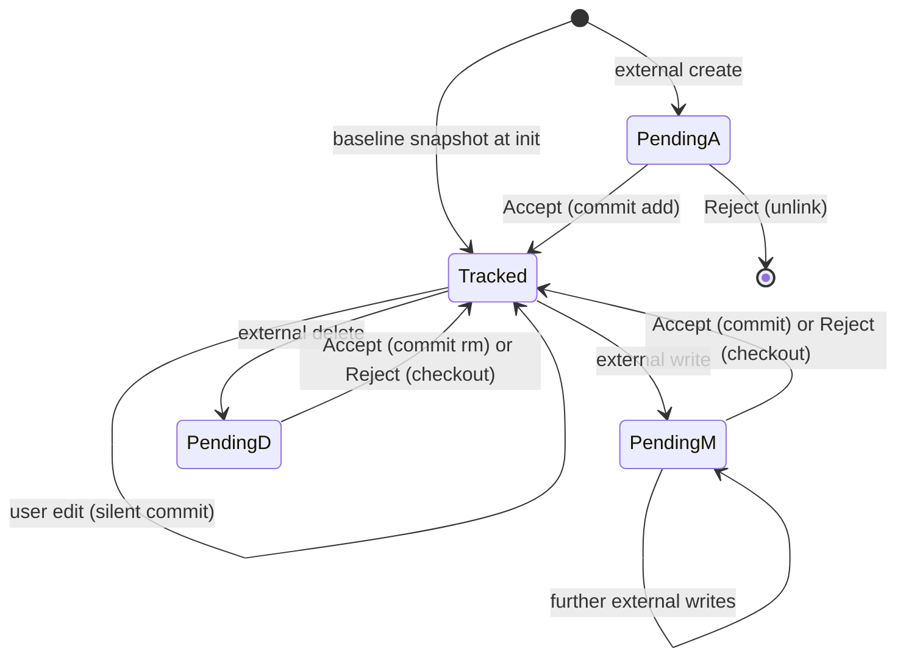
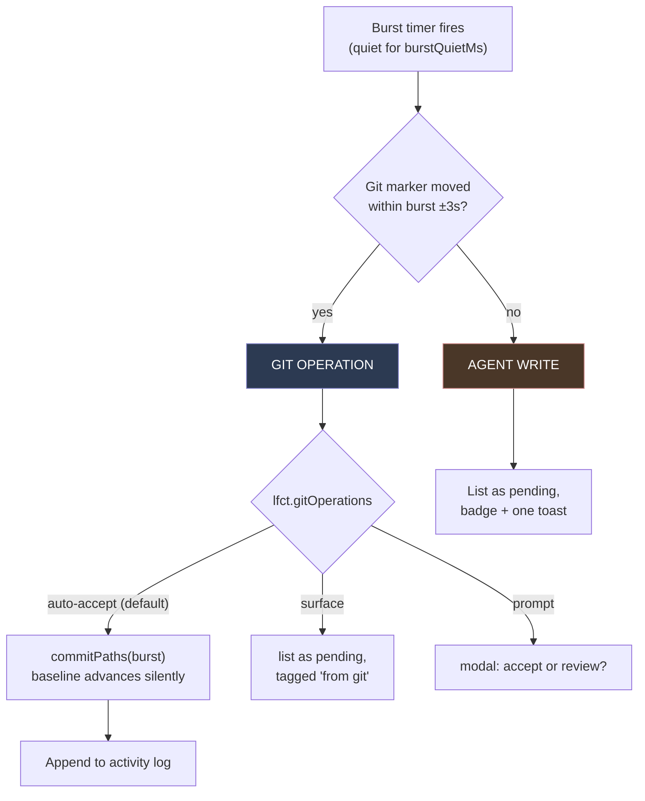

# Local File Change Tracker — Engineering Plan

**Status:** Draft for review
**Date:** 2026-07-25
**Target:** VS Code extension, TypeScript, public Marketplace release
**Audience:** Implementing engineer

---

## 1. Problem Statement

CLI coding agents (Claude Code, opencode, and similar) modify files on disk directly. By the time a human notices, the change is already applied. The existing safety nets are inadequate:

- **Git** requires the user to have committed at the right moment. In practice the agent's edits land on top of the user's own uncommitted work, so `git checkout` throws away both.
- **Editor undo** is per-buffer, dies on window reload, and does not cover files the agent created or deleted while they were closed.
- **Agent-native checkpoints** (Cursor, Antigravity, Kilo Code) only cover edits made by *that* agent. They are IDE forks or single-agent extensions; they know which files they touched because they *are* the writer.

This tool provides an agent-agnostic, always-on, per-file undo boundary that works regardless of which CLI agent made the edit, and regardless of the state of the user's real git repository.

### 1.1 The core inversion

This is **not** a gatekeeper. It does not intercept, stage, or approve writes. The change is already on disk by the time we see it.

| Action | Effect on disk | Purpose |
| --- | --- | --- |
| **Accept** | **None.** | Bookkeeping only. Advances the baseline to current content so the file stops being reported. |
| **Reject** | **Overwrites the file.** | The actual product. Restores content from baseline; deletes the file if the baseline says it did not exist. |

Every design decision below follows from this asymmetry: Accept is free and cheap, Reject is the feature, and losing a baseline means losing the ability to recover.

---

## 2. Goals and Non-Goals

### 2.1 Goals (v1)

- G1 — Detect file mutations made by external processes inside the workspace.
- G2 — Distinguish those from the user's own in-editor edits, which must advance the baseline silently.
- G3 — Present the divergent files in a native, familiar VS Code surface with per-file diff, Accept, and Reject.
- G4 — Reject restores exact prior byte content, including for created and deleted files.
- G5 — Survive window reload, workspace close, and machine restart. Baselines are durable and retained indefinitely.
- G6 — Track files the project's `.gitignore` excludes (notably `.env`), while excluding dependency and build directories. **Hard requirement** — see §5.5.
- G7 — Zero configuration for a typical project. No setup step, no per-project init.
- G8 — Do not fight the user's own git. Work-tree changes caused by `pull`, `rebase`, `stash`, `reset`, or `checkout` must not appear as pending changes.
- G9 — Clicking a changed file opens an **inline unified diff** — additions and deletions interleaved in one column — not a two-pane side-by-side view. See §7.5.1.

### 2.2 Non-Goals (v1)

- N1 — In-editor agents (Kilo Code, Cline, Copilot Agent). Deferred; see §14.
- N2 — Multi-root workspaces. Detect and disable with a clear message.
- N3 — Per-hunk operations. Whole-file only. See §14.
- N4 — Per-turn rewind UI. The internal store records per-burst checkpoints (§5.4) so this is addable later without migration, but v1 exposes a single rolling baseline.
- N5 — Remote / SSH / WSL / Codespaces. Untested in v1; do not claim support.
- N6 — Syncing baselines across machines.

### 2.3 Explicitly accepted trade-offs

| Trade-off | Consequence | Accepted because |
| --- | --- | --- |
| Single rolling baseline | Cannot undo only the *last* of five agent turns. Reject goes back to the last Accept. | Matches the mental model. Frequent Accept keeps the boundary tight. |
| Undo behavior unspecified | <kbd>Cmd</kbd>+<kbd>Z</kbd> after Reject may resurrect agent changes. | Deferred by product decision; revisit post-v1. |
| Content-based attribution | Editing a file in vim/external editor is reported as an agent change. | Harmless false positive. User accepts it. |
| `.env` is tracked | Secrets persist in the local object store indefinitely. | Required by G6. Store is local-only and never pushed. Documented in README. |

---

## 3. Glossary

| Term | Meaning |
| --- | --- |
| **Baseline** | The last accepted content of a file. Concretely, `HEAD` in the shadow repository. |
| **Shadow repo** | A git repository whose `GIT_DIR` lives in extension storage and whose work tree is the user's project. Invisible to the project and to agents. |
| **Pending change** | A file whose on-disk content differs from baseline. Modified, created, or deleted. |
| **Attribution** | Deciding whether a filesystem write came from the user's editor or an external process. |
| **Expected write** | A disk write the extension anticipates because the editor just saved. Used to suppress self-attribution. |
| **Burst** | A run of external writes separated by less than the quiet threshold. Approximates one agent turn. |
| **Denylist** | Our own exclusion rules. Deliberately independent of the project's `.gitignore`. |

---

## 4. User-Facing Behavior

### 4.1 The surface

The extension registers a `SourceControl` provider. It appears in the **Source Control** view alongside Git.

```
SOURCE CONTROL                                    ⋯
                                          ┌─────────────────────────┐
▼ Git                              ⎇ main │ scm/title menu:         │
    (the user's normal git changes)       │   ✓ Accept All          │
                                          │   ↺ Reject All          │
▼ AI Changes                           3  │   ⟳ Refresh             │
    src/app.ts               ✓  ↺      M  └─────────────────────────┘
    src/utils.ts             ✓  ↺      M
    .env                     ✓  ↺      M
    src/generated.ts         ✓  ↺      A
    src/old-helper.ts        ✓  ↺      D

  ✓ = Accept (advance baseline, no disk write)
  ↺ = Reject (restore from baseline)
  click a file → diff: baseline ◀▶ current
```

Using the SCM API rather than a custom `TreeView` buys, at no implementation cost:

- Native resource list styling, keyboard navigation, and multi-select.
- Inline per-resource action icons via `menus` contributions.
- The count badge on the Activity Bar icon.
- **Quick-diff gutter indicators.** Setting `SourceControl.quickDiffProvider` puts colored change bars in the editor gutter of every open file, showing precisely which lines the agent touched, live, without opening a diff editor. This is a significant UX win for free.

### 4.2 Resource states

| State | Letter | Meaning | Reject does |
| --- | --- | --- | --- |
| Modified | `M` | Exists in baseline and on disk, content differs | Restore baseline content |
| Added | `A` | Not in baseline, exists on disk | Delete the file |
| Deleted | `D` | In baseline, missing from disk | Recreate with baseline content |

Renames are decomposed into `A` + `D` in v1. No rename detection.

### 4.3 Notification behavior

When a burst of external writes settles (§5.5):

- Badge count updates — always.
- Toast: *"3 files changed by an external process"* with a **Review** action opening the SCM view. Controlled by `lfct.notification`, default `toast`.

Notifications must be **per burst**, never per file, or an agent writing 40 files produces 40 toasts.

### 4.4 Commands

| Command ID | Title | Surface |
| --- | --- | --- |
| `lfct.acceptFile` | Accept | inline, context menu |
| `lfct.rejectFile` | Reject | inline, context menu |
| `lfct.acceptAll` | Accept All Changes | SCM title bar |
| `lfct.rejectAll` | Reject All Changes | SCM title bar |
| `lfct.openDiff` | Open Changes | resource click (default) — inline unified, §7.5.1 |
| `lfct.openDiffSideBySide` | Open Changes (Side by Side) | context menu |
| `lfct.toggleDiffView` | Toggle Inline / Side-by-Side Diff | Command Palette |
| `lfct.refresh` | Refresh | SCM title bar |
| `lfct.revealStorage` | Reveal Checkpoint Storage | Command Palette |
| `lfct.listStores` | Manage Checkpoint Storage | Command Palette |
| `lfct.rebuildBaseline` | Rebuild Baseline From Disk | Command Palette |

### 4.5 Confirmation rules

Reject is destructive and not reliably undoable. Require confirmation via `showWarningMessage({ modal: true })` when:

- `lfct.rejectAll` is invoked — always.
- Rejecting a file with **unsaved editor changes**. The user's in-buffer work will be discarded. Message must say so explicitly.
- Rejecting an `A` file, since it will be deleted from disk.

Single-file Reject on a clean `M` file needs no confirmation. Requiring one on every reject trains the user to click through.

### 4.6 Scenario walkthroughs

End-to-end behavior for the situations that actually occur during a working session. Each is a test case.

**S1 — First open of a project.**
Extension activates on `onStartupFinished`. No baseline exists, so it walks the tree (denylist-pruned), force-adds every eligible file, and commits. Progress notification for anything over ~1s. Reject is disabled until this completes. Pending list: empty. Nothing else is visible to the user; there is no setup step.

**S2 — Agent edits 3 files.**
Agent writes `app.ts`, `utils.ts`, `router.ts` over ~4s. Each write trips the watcher, none is in the expected-writes set, so each is classified external and added to the burst. 750ms after the last write the burst settles, no `.git` marker moved, so origin is `agent`. SCM badge shows `3`, one toast fires, and gutter change bars appear in any of those files that are open.

**S3 — User reviews and accepts everything.**
Clicks `app.ts` → inline unified patch opens, one column, `+`/`-` colored. Reviews the other two. Clicks **Accept All** in the SCM title bar. Three paths are committed to the shadow repo. **No file on disk is touched.** List empties, badge clears, gutter bars vanish.

**S4 — User rejects one, accepts the rest.**
`utils.ts` looks wrong. Reject on that row: the path is suppressed in the detector, `git checkout HEAD -- utils.ts` restores it, the open buffer reloads from disk, and the suppressed watcher event is swallowed. `utils.ts` leaves the list. The remaining two stay pending until Accept.

**S5 — User edits by hand between agent turns.**
User types in `app.ts` and saves. `onDidSaveTextDocument` seeds the expected-writes set, the watcher event matches within the grace window, and the file is committed silently. Baseline advances. **Nothing appears in the list, no badge, no toast.** This is the behavior that keeps the list meaningful.

**S6 — Agent creates a file.**
`generated.ts` did not exist at baseline. The reconciliation set difference (`walk()` − `git ls-files`) classifies it `A`. Its inline diff renders against empty, so the whole file shows as additions. Reject prompts for confirmation (it deletes), unlinks the file, then prunes any directory left empty.

**S7 — Agent deletes a file.**
`old-helper.ts` is in the index but missing from disk → `D`, shown struck through. Reject runs `git checkout HEAD -- old-helper.ts`, recreating it with exact baseline bytes.

**S8 — Agent rewrites `.env`.**
Tracked despite `.gitignore`, because the baseline force-added it and ignore rules never apply to tracked paths. Surfaces as `M` like any other file. Reject restores the original secrets verbatim. This is the scenario §5.5 exists for.

**S9 — User runs `git pull` mid-session.**
200 work-tree files change. The burst builds normally, but at settle time `.git/ORIG_HEAD` and `HEAD` moved inside the window, so origin is `git`. All 200 paths are auto-accepted, the baseline advances silently, and **nothing enters the pending list**. An entry lands in the activity log. Without this, Reject All would have undone the pull.

**S10 — Agent runs `git stash` itself.**
Identical handling to S9 — the marker check cannot and need not distinguish who invoked git. Auto-accepted, logged.

**S11 — Agent writes a file the user has unsaved edits in.**
Surfaces as `M`. On **Accept**, nothing is written, so the buffer keeps the user's unsaved work and their eventual save is attributed as a user edit. On **Reject**, a modal warns that unsaved work will be discarded; on confirm the buffer is force-reverted from disk.

**S12 — Agent renames a folder.**
`src/` → `lib/`, 200 files. The watcher may coalesce this into one directory event, so the directory event forces an immediate reconciliation sweep. Walk-vs-index resolves it to 200 `D` + 200 `A`. Reject All restores every file at its original path, deletes the copies, and prunes the now-empty `lib/`.

**S13 — Two agent turns without an Accept in between.**
Turn 2's changes accumulate onto turn 1's. The list shows the union, each file diffed against the single rolling baseline. Reject takes a file all the way back past both turns — there is no per-turn granularity in v1 (N4). Frequent Accept is what keeps the boundary tight.

**S14 — Agent writes into `dist/` or `node_modules/`.**
Denylisted, never walked, never surfaced. Expected and documented (E7).

**S15 — VS Code was closed while the agent ran.**
No watcher events were received at all. On activation the reconciliation sweep compares walk against index and surfaces every change. This is why correctness rests on the sweep and not on the watcher.

---

## 5. Architecture

### 5.1 Component diagram



### 5.2 Why a shadow git repo

The store must snapshot an entire source tree cheaply, deduplicate across snapshots, and restore individual paths atomically. That is precisely git's job, and a hand-rolled content-addressed blob store would be a worse reimplementation of it.

| Requirement | Shadow git |
| --- | --- |
| Snapshot 10k files fast | Index stat-cache: only changed files are re-hashed |
| Dedup + compress | Free, plus `gc` packing |
| Restore one path | `git checkout HEAD -- <path>` — battle-tested |
| Produce diffs | `git diff`, `git show` |
| Future per-turn history | Already a commit DAG |

**Cost:** hard dependency on a `git` binary. Acceptable — the target user runs CLI coding agents. Detect at activation and fail with an actionable message if absent.

### 5.3 Storage layout

`context.storageUri` — VS Code's per-workspace extension storage. Not `globalStorage` (not workspace-scoped) and emphatically **not a folder inside the workspace**.

A `.checkpoints/` directory inside the project would be actively harmful here:

- The agent can see, read, and rewrite it. The undo mechanism must sit outside the blast radius of the thing it undoes.
- Our own watcher would fire on our own writes.
- It gets swept into `tsconfig` includes, bundler globs, test discovery, and search results.
- It needs `.gitignore` management and gets committed by the first `git add -A`.

```
~/Library/Application Support/Code/User/workspaceStorage/
└── <workspace-hash>/
    └── SajanRajbanshi.ai-undo/
        ├── shadow.git/              GIT_DIR. Never a .git inside the project.
        │   ├── objects/             content-addressed, packed by gc
        │   ├── refs/heads/main
        │   ├── index                stat-cache; makes incremental snapshots fast
        │   └── config               core.worktree, core.bare=false, hooksPath
        └── meta.json                { version, worktreePath, createdAt,
                                        lastAcceptAt, schemaVersion }
```

`meta.json` records `worktreePath` so a stale store can be detected if the workspace was moved, and so `lfct.listStores` can present something human-readable.

### 5.4 Repository initialization

Run once, on first activation for a workspace. Every flag here exists to defend against the user's global git configuration leaking in.

```bash
GIT_DIR=<storage>/shadow.git
GIT_WORK_TREE=<workspaceRoot>

git -c init.templateDir= init          # no user hook templates
git config core.bare false             # GIT_DIR-only init may set bare
git config core.worktree <workspaceRoot>
git config core.hooksPath /dev/null    # never run the user's pre-commit hooks
git config commit.gpgsign false        # global gpgsign would prompt or fail
git config user.name  "Local File Change Tracker"
git config user.email "lfct@localhost" # global identity may be unset
git config core.fsmonitor true         # git >= 2.37, large win on macOS
git config core.untrackedCache true
git config core.preloadIndex true
git config core.autocrlf false         # never rewrite line endings
git config core.safecrlf false
git config core.fileMode true          # preserve the executable bit
git config gc.auto 256

# Neutralize the project's .gitattributes — see 5.4.1
printf '* -text -diff -filter -merge\n' > "$GIT_DIR/info/attributes"
```

> **Verify during implementation:** the exact behavior of `git init` when `GIT_DIR` is set via environment on git 2.50. If it produces a bare repo, `core.bare false` + `core.worktree` corrects it, but confirm with a test rather than assuming.

Failing to set `core.hooksPath` means a project's `pre-commit` hook (lint, format, test) runs on **every checkpoint commit**, which would be catastrophic for performance and correctness. This is not optional.

#### 5.4.1 `.gitattributes` — the second content-mangling hazard

Goal G4 requires **byte-exact** restore. A project's `.gitattributes` can silently break that, because git applies content conversion on both `add` and `checkout`:

| Attribute | Effect on our round-trip |
| --- | --- |
| `* text=auto` | CRLF↔LF normalization. Files with mixed line endings do not survive the round-trip byte-identically. |
| `filter=lfs` | **Catastrophic.** If the project uses Git LFS and the user has it installed, `git add` runs the clean filter and stores a *pointer file* instead of the content. Restore then writes the pointer over the user's real file. |
| Any custom `filter` | Arbitrary content rewriting on add and checkout. |
| `merge=`, `diff=` | Affects our diff output. |

`core.autocrlf false` alone does **not** fix this, because an in-tree `text=auto` overrides it.

Fortunately, gitattributes precedence runs the **opposite** direction to gitignore:

> `$GIT_DIR/info/attributes` has the **highest** precedence, above in-tree `.gitattributes`.

So a single line in the shadow repo's `info/attributes` neutralizes every in-tree attribute:

```
* -text -diff -filter -merge
```

`-text` disables line-ending conversion, `-filter` disables clean/smudge (including LFS), and content passes through verbatim in both directions. Write this at init, before the first `add`.

> This is the exact mirror of §5.5: there, in-tree files win and we must route around git; here, `$GIT_DIR` wins and one line suffices. Do not assume the precedence rules match — they do not.

All git invocations pass `GIT_DIR`/`GIT_WORK_TREE` explicitly in `env` rather than relying on `cwd`. Shell out via `child_process.execFile` — never `exec`, to avoid shell interpolation of paths.

### 5.5 The `.gitignore` problem, and why git must not own file selection

**This is the single most important design decision in the plan.**

Requirement G6 says: exclude `node_modules` and build output, but **track** `.env` and other gitignored local state. That inverts the obvious approach.

`.gitignore` conflates two unrelated categories — *"generated junk I don't care about"* and *"local state that matters enormously"*. It is therefore the wrong signal, and must not be our exclusion source.

Worse, the shadow repo will honor it by default: `.gitignore` files live in the *work tree*, not the git dir, so git reads the project's ignore rules automatically.

And it cannot be overridden from `info/exclude`, because gitignore precedence is, highest to lowest:

1. Patterns from the **command line**
2. `.gitignore` files in the work tree
3. `$GIT_DIR/info/exclude`
4. `core.excludesFile`

`.gitignore` **outranks** `info/exclude`. A `!.env` negation there loses.

**Half the solution — force-add.** `git add -f` bypasses every ignore source, and once a path is *tracked*, gitignore stops applying to it entirely. Modifications, deletions, and restores of `.env` then work normally forever after. That part is sound.

**The remaining hole — detecting newly *created* ignored files.** A file the agent creates that matches `.gitignore` (say `.env.local`) is untracked-and-ignored, and plain `git status --porcelain` will not list it. Neither `--ignored` mode fixes this:

| Mode | Behavior | Why it fails us |
| --- | --- | --- |
| `--ignored=traditional -uall` | Lists every file *inside* ignored directories | If `node_modules` is gitignored, that is 60k entries on every sweep |
| `--ignored=matching` | Collapses an ignored directory to one entry | A file we want inside an ignored directory (`config/` ignored, `config/local.json` matters) becomes invisible |

There is no git flag meaning *"pretend `.gitignore` does not exist."*

### 5.5.1 Resolution — own the enumeration

**Remove git from file-selection entirely.** We already walk the tree to apply the denylist; make that walk authoritative and demote git to a pure content store and restore engine.

| Concern | Owner | Mechanism |
| --- | --- | --- |
| Which files exist | **Us** | `WorkspaceWalker`, pruned at directory level by the denylist |
| Which are new | **Us** | `walk()` − `git ls-files` (set difference) |
| Which are modified | git | `git diff --name-status HEAD` — tracked paths, gitignore irrelevant |
| Which are deleted | git | same diff, status `D` |
| Adding to baseline | git | `git add -f --pathspec-from-file=- --pathspec-file-nul`, exact paths on **stdin** |

Every ignore source — the project's `.gitignore`, nested `.gitignore` files in subdirectories, `$GIT_DIR/info/exclude`, and `core.excludesFile` — becomes irrelevant **by construction** rather than by override. The precedence table above stops mattering.

Three further benefits:

1. **No argv limit.** Paths travel over stdin, NUL-separated. The ~100-pattern cap disappears, and pathological path characters are safe.
2. **`node_modules` is never enumerated.** The walker prunes at the directory level *before descending*, so a 60k-file dependency tree costs one `readdir` and one string comparison — not 60k stats.
3. **One testable policy.** File selection lives in a single TypeScript function instead of being split between our denylist and git's precedence rules. §13.1 can exercise it exhaustively without a repository.

### 5.5.2 `WorkspaceWalker`

```ts
class WorkspaceWalker {
  /** Repo-relative paths of every tracked-eligible file. Prunes at directory level. */
  walk(token?: CancellationToken): Promise<string[]>;
}
```

Recursive `fs.opendir` with `withFileTypes`. On each directory entry, test the directory against L1/L2 **before** descending — never `readdir` into an excluded tree. Apply the L3 size cap via the `Dirent` stat only for files that survive. Do not follow symlinks out of the work tree (E11).

Budget: a 10k-file tree with pruning walks in roughly 50–200ms on an SSD, which is what makes the reconciliation sweep (§7.3) affordable at the frequencies specified in §9.

### 5.6 The denylist

Four layers, evaluated in order:

**L1 — Universal.** `.git`, `node_modules`, `.DS_Store`, `Thumbs.db`, and our own storage path.

**L2 — Ecosystem build and dependency directories.**

| Ecosystem | Patterns |
| --- | --- |
| JS/TS | `dist`, `build`, `out`, `.next`, `.nuxt`, `.svelte-kit`, `.turbo`, `.parcel-cache`, `.cache`, `coverage`, `bower_components` |
| Python | `.venv`, `venv`, `env`, `__pycache__`, `*.pyc`, `.pytest_cache`, `.mypy_cache`, `.ruff_cache`, `*.egg-info` |
| Rust / Java / Kotlin | `target`, `.gradle`, `.m2` |
| .NET | `bin`, `obj` |
| Go / PHP | `vendor` |
| iOS / macOS | `Pods`, `DerivedData`, `*.xcworkspace/xcuserdata` |
| Infra | `.terraform`, `.serverless` |
| Editors | `.idea`, `.vscode-test`, `*.swp` |

> `bin`, `env`, `out`, and `target` are ambiguous — some projects have real source in them. They must be overridable via `lfct.include`.

**L3 — Size cap.** Skip files above `lfct.maxFileSizeMB` (default 5). Catches datasets, model weights, media, lockfile-adjacent blobs. Enforced by a stat check during the pathspec build, not by git.

**L4 — User overrides.** `lfct.exclude` adds patterns; `lfct.include` removes them from the computed denylist. `lfct.include` wins over L2 and L3, never over L1.

Binary detection is deliberately **not** a denylist layer. Git stores binaries fine and dedupes them; the size cap already handles the pathological cases. Binary files simply get no useful diff view (§7.5).

---

## 6. Attribution

### 6.1 The problem

Antigravity, Cursor, and Windsurf never solve this: they are IDE forks and the agent's write goes through their own code, so authorship is known at write time with perfect fidelity. Kilo Code likewise knows, because it is the writer.

We are doing forensic attribution after the fact, for agents we do not control. That is strictly harder — and it is also what makes the tool work across all agents rather than one.

### 6.2 The signal

A VS Code save and an external process write both trip `FileSystemWatcher.onDidChange`. They are distinguished by whether the editor *told us it was about to happen*.



### 6.3 The expected-writes set

`Map<string, number>` — absolute path to timestamp.

- **Populate** on `onDidSaveTextDocument`, `onDidCreateFiles`, `onDidDeleteFiles`, `onDidRenameFiles`. These fire *before* or *around* the disk write, giving us the ordering we need.
- **Consume** on the corresponding watcher event: match, delete the entry, classify as user edit.
- **Expire** entries older than `lfct.userEditGraceMs` (default 2000) on a sweep. Without expiry, a save whose watcher event is dropped leaves a permanent entry that would misclassify a later agent write to that same path.

`onWillSaveTextDocument` is not used — it can delay the save, and we need no veto.

### 6.4 Sequence: user edit (silent baseline advance)



### 6.5 Sequence: agent edit (surface as pending)

```mermaid
sequenceDiagram
    autonumber
    participant A as CLI Agent
    participant FS as Filesystem
    participant W as FileSystemWatcher
    participant D as ChangeDetector
    participant SC as ScmProvider
    participant U as User

    A->>FS: write app.ts
    A->>FS: write utils.ts
    A->>FS: create generated.ts
    W-->>D: onDidChange(app.ts)
    D->>D: not in expectedWrites → EXTERNAL
    D->>D: pending.add(app.ts); resetBurstTimer()
    W-->>D: onDidChange(utils.ts)
    D->>D: pending.add(utils.ts); resetBurstTimer()
    W-->>D: onDidCreate(generated.ts)
    D->>D: pending.add(generated.ts); resetBurstTimer()
    Note over D: quiet for burstQuietMs (750ms)
    D->>SC: refresh()
    SC->>SC: git diff --name-status HEAD<br/>+ untracked scan
    SC->>U: badge = 3, one toast, quick-diff gutter bars
```

### 6.6 Sequence: reject



> **Step 5 is not optional.** Our own restore write trips the watcher. Without pre-arming a suppression entry, the extension classifies its own revert as a fresh external write and immediately re-lists the file it just restored. The suppression must be set **before** the write begins, and cleared on match or on a timeout.

### 6.7 File state machine



Note that Accept and Reject both terminate in `Tracked`, and both leave the file absent from the pending list. They differ only in what is on disk.

### 6.8 Git operations in the user's real repository

`git pull`, `merge`, `rebase`, `reset`, `checkout`, `stash push/pop`, and `revert` all rewrite work-tree files from an external process. Under the §6.2 signal alone they are indistinguishable from an agent, so a `git pull` touching 200 files would fill the pending list with 200 entries.

That is not merely noise — it is dangerous. **Reject All would undo the pull.**

**Principle: this tool exists for changes that have no other safety net.** Git operations have the reflog, `ORIG_HEAD`, and the stash. Agent writes have nothing. So git-originated writes are **auto-accepted**: the baseline advances silently, exactly as for a user edit.

**Detection.** Primary source is the built-in Git extension's API, which already watches `.git` and therefore also observes operations run from a terminal:

```ts
const git = extensions.getExtension<GitExtension>('vscode.git')?.exports.getAPI(1);
repo.state.onDidChange(() => { /* HEAD.commit, rebaseCommit, mergeChanges moved */ });
```

Fallback for when that extension is disabled: a direct `fs.watch` on `<repo>/.git` for `HEAD`, `ORIG_HEAD`, `MERGE_HEAD`, `CHERRY_PICK_HEAD`, `refs/stash`, and the presence of `rebase-merge/` or `rebase-apply/`. Use Node's `fs.watch` rather than VS Code's `FileSystemWatcher` — the latter is subject to `files.watcherExclude`, whose defaults already touch `.git`.

**The ordering problem.** Git writes work-tree files *before* it updates `HEAD`, so our file events arrive before we know an operation occurred. Per-event classification therefore cannot work.

**Resolution: classify at burst-settle time.** When the burst timer fires, ask whether any git marker moved within the burst window ±`gitOpWindowMs` (default 3000). If yes, the entire burst is git-originated.



**Caveat worth surfacing to the user.** Agents run git themselves — Claude Code issues `git checkout` and `git stash` routinely — so those writes are auto-accepted too. Defensible, since git's own recovery then applies, but it is a real gap in coverage. Hence `lfct.gitOperations` with `auto-accept` (default) / `surface` / `prompt`, and an activity log recording every auto-accepted operation with its file count so the behavior is never invisible.

If the workspace is not a git repository at all, this entire subsystem is inert.

### 6.9 Renames

**File rename** needs no special handling. `mv old.ts new.ts` produces a delete plus a create, surfacing as `D old.ts` and `A new.ts`. Rejecting both restores `old.ts` and deletes `new.ts` — net effect correct. A rename performed through the VS Code Explorer fires `onDidRenameFiles`, which adds **both** paths to the expected-writes set, so it is correctly attributed as a user edit.

**Folder rename is the real hazard.** On macOS, FSEvents may coalesce a directory rename into a single event for the directory rather than emitting one per contained file. Renaming `src/` with 200 files inside could therefore surface as almost nothing, leaving 200 files silently unprotected.

Three mitigations, in order of reliability:

1. **Directory events force a sweep.** Any create or delete event whose target is a directory triggers an immediate reconciliation rather than trusting per-file events to arrive.
2. **The sweep is definitive.** `walk()` versus `git ls-files` (§7.4) compares complete sets, so a folder rename resolves to 200 `D` + 200 `A` regardless of what the watcher reported. This is the correctness guarantee; the watcher is only a latency optimization.
3. **Empty-directory pruning on reject.** `git checkout` recreates parent directories when restoring, but `unlink` does not remove them. Rejecting a folder rename would otherwise leave `lib/` behind as an empty husk. After any unlink batch, walk parent directories upward from each deleted path and remove those left empty, stopping at the workspace root and never crossing it.

**Rename pairing in the UI** — displaying `old.ts → new.ts` as a single row via `git diff -M` — is deferred (§16). It is presentation only; the A+D decomposition is already correct, and an added file simply diffs against empty.

---

## 7. Component Specifications

### 7.1 `CheckpointStore`

Sole owner of the shadow repo. No other module shells out to git.

```ts
interface FileStatus {
  relPath: string;
  status: 'M' | 'A' | 'D';
}

class CheckpointStore {
  static async open(storageUri: Uri, worktree: string): Promise<CheckpointStore>;

  /** True if HEAD exists — i.e. the initial baseline has been taken. */
  hasBaseline(): boolean;

  /** Full snapshot. Only on first activation or lfct.rebuildBaseline. */
  createInitialBaseline(
    paths: string[],
    progress: Progress<{ increment: number }>,
    token: CancellationToken,
  ): Promise<void>;

  /**
   * Accept. Advances baseline for the given paths. No disk mutation.
   * Paths are piped to `git add -f --pathspec-from-file=- --pathspec-file-nul`,
   * so there is no argv limit and no ignore rule participates (§5.5.1).
   */
  commitPaths(relPaths: string[], reason: string): Promise<void>;

  /** Everything diverging from HEAD, denylist already applied. */
  status(): Promise<FileStatus[]>;

  /** Reject. Mutates the work tree. */
  restore(relPaths: string[]): Promise<void>;

  /** Baseline content for the diff view. null if not in HEAD. */
  readBaseline(relPath: string): Promise<Uint8Array | null>;

  gc(): Promise<void>;
  dispose(): void;
}
```

**Serialization.** All git invocations run through a single promise queue. Concurrent `git add`/`git commit` on one index corrupts it or fails on `index.lock`. This is a hard requirement, not an optimization.

**`index.lock` recovery.** If a previous host crashed mid-commit, a stale `shadow.git/index.lock` blocks everything. On `open()`, if the lock exists and is older than 60s, delete it and log.

### 7.2 `IgnoreRules`

```ts
class IgnoreRules {
  constructor(config: LfctConfig, storagePath: string);

  /** For the watcher hot path. Must be synchronous and allocation-light. */
  isTracked(absPath: string): boolean;

  /** Directory-level prune test, called by the walker BEFORE descending. */
  shouldPruneDir(absDirPath: string): boolean;

  /** L3. Async because it stats. */
  isWithinSizeCap(absPath: string): Promise<boolean>;
}
```

No `toPathspecs()`. Per §5.5.1 git is never told about exclusions — it receives an explicit path list on stdin, and `shouldPruneDir` is what keeps that list from ever containing `node_modules`.

Use `picomatch` or `minimatch` with precompiled matchers. `isTracked` runs on every filesystem event in the workspace — during an `npm install` that is tens of thousands of calls per second. Compile once, cache results in a bounded LRU keyed by directory prefix.

### 7.3 `ChangeDetector`

```ts
class ChangeDetector {
  private expectedWrites = new Map<string, number>();   // §6.3
  private suppressed     = new Map<string, number>();   // §6.6
  private pending        = new Set<string>();
  private burstStartedAt = 0;                           // §6.8 classification
  private burstTimer?: NodeJS.Timeout;

  suppressPath(absPath: string): void;      // call BEFORE our own writes
  onBurstSettled: Event<{ paths: string[]; origin: 'agent' | 'git' }>;
}
```

`origin` is resolved when the burst timer fires, not per event, because git updates `HEAD` *after* writing the work tree (§6.8).

Watcher: `workspace.createFileSystemWatcher('**/*')`.

**Known watcher limitations, both of which need mitigation:**

1. VS Code's watcher honors the user's `files.watcherExclude` setting. Defaults exclude `**/node_modules/*/**` and `**/.git/objects/**` — convenient for us, but a user who has excluded a source directory will silently get no events for it.
2. The watcher can drop events under heavy filesystem load, and does not fire for changes made while the window was closed.

**Mitigation — reconciliation sweep.** A full `status()` comparison, run:

- on activation, after the baseline exists;
- on `window.onDidChangeWindowState` when focus is regained, throttled to once per 30s;
- **on any create or delete event whose target is a directory** — folder renames may be coalesced into a single watcher event, so per-file events cannot be trusted (§6.9);
- after every git operation burst (§6.8);
- on the `lfct.refresh` command;
- on a low-frequency timer (`lfct.reconcileIntervalMs`, default 60000, `0` disables).

The sweep is authoritative. The watcher is an optimization for latency. Correctness must not depend on the watcher alone.

### 7.4 `ScmProvider`

```ts
const scm = vscode.scm.createSourceControl('lfct', 'AI Changes', workspaceRootUri);
scm.quickDiffProvider = baselineQuickDiff;      // gutter change bars
scm.inputBox.visible = false;                    // no commit message concept

const group = scm.createResourceGroup('pending', 'Pending Changes');
group.hideWhenEmpty = true;
```

Each `SourceControlResourceState` carries:

- `resourceUri` — the real file URI.
- `command` — `lfct.openDiff` with the resource as argument.
- `decorations` — `strikeThrough: true` for `D`, plus per-status icon and tooltip.
- `contextValue` — `'M' | 'A' | 'D'`, so `menus` `when` clauses can vary per status.

`scm.count` drives the badge.

**Status computation** unions two sources, per §5.5.1. Note that `git status` is **not** used at any point — its ignore handling is precisely what this design removes.

```ts
// 1. Modified + deleted. Tracked paths only, so gitignore cannot apply.
const changed = parseNameStatus(
  await git('diff', '--name-status', '-z', 'HEAD'),
);                                                      // → M | D

// 2. Created. Our walk minus git's index — gitignore never consulted.
const onDisk  = new Set(await walker.walk());           // denylist-pruned
const tracked = new Set(await git('ls-files', '-z'));
const added   = [...onDisk].filter(p => !tracked.has(p));  // → A

return [...changed, ...added.map(toAddedState)];
```

`git ls-files` reads the index, which after a force-add contains `.env` and every other ignored-but-tracked path. The set difference is therefore exact, and no ignore rule participates.

Contributions in `package.json`:

```jsonc
"menus": {
  "scm/title": [
    { "command": "lfct.acceptAll", "when": "scmProvider == lfct", "group": "navigation@1" },
    { "command": "lfct.rejectAll", "when": "scmProvider == lfct", "group": "navigation@2" }
  ],
  "scm/resourceState/context": [
    { "command": "lfct.acceptFile", "when": "scmProvider == lfct", "group": "inline@1" },
    { "command": "lfct.rejectFile", "when": "scmProvider == lfct", "group": "inline@2" }
  ]
}
```

### 7.5 `BaselineContentProvider`

A `TextDocumentContentProvider` on scheme `lfct`, serving the left-hand side of the diff.

```
URI: lfct:/src/app.ts?ref=HEAD
      └┬─┘└────┬────┘ └───┬───┘
    scheme  repo-rel   future: per-commit history
```

`provideTextDocumentContent` calls `store.readBaseline(relPath)`. Returns `''` when the path is absent from `HEAD`, which renders an added file as a diff against empty — correct and readable.

Fire the provider's `onDidChange` for affected URIs after every Accept and Reject, or open diff editors display stale baseline content.

**Binary files.** `provideTextDocumentContent` returns a string, so binaries render as mojibake. Detect binary content (NUL byte in the first 8KB) and instead show a placeholder document: *"Binary file — N bytes at baseline, M bytes now. Accept and Reject still work."* Accept and Reject are unaffected; only the diff view degrades.

### 7.5.1 Diff presentation — inline unified, not side-by-side

**Requirement G9: clicking a file shows one column with additions and deletions interleaved, not two panes.**

The constraint that shapes this: **VS Code exposes no per-editor API to open its diff editor in inline mode.** Inline rendering is governed by the global `diffEditor.renderSideBySide` setting, and `vscode.diff` accepts only `TextDocumentShowOptions` (`preview`, `viewColumn`, `preserveFocus`, `selection`) — nothing about render mode. Flipping the global setting on the user's behalf is not acceptable: it would silently change every diff they open, including Git's.

So we render the unified view ourselves. Three surfaces, all native, none requiring a webview:

| # | Surface | What it gives | Default |
| --- | --- | --- | --- |
| 1 | **Unified patch view** | One column, `+`/`-` interleaved, red/green. Read-only. | **Click action** |
| 2 | **Quick-diff gutter + peek** | Change bars in the real, editable file; click a bar to peek the original lines inline | Always on |
| 3 | **Native side-by-side** | `vscode.diff`, two panes | Secondary command |

#### Surface 1 — unified patch view (default)

Generate the patch with git and open it as a read-only virtual document rendered with VS Code's built-in `diff` grammar, which colors additions green and deletions red with no dependency and no custom rendering code.

```ts
// Modified / deleted — tracked paths
const patch = await git('diff', '--no-color', 'HEAD', '--', relPath);

// Added — not in the index yet; exits 1 when differences exist, so allow it
const patch = await git.allowExit(1)(
  'diff', '--no-color', '--no-index', '--', '/dev/null', absPath,
);

const uri = Uri.parse(`lfct-patch:/${relPath}.diff`);   // .diff → correct grammar
const doc = await workspace.openTextDocument(uri);
await languages.setTextDocumentLanguage(doc, 'diff');   // belt and braces
await window.showTextDocument(doc, { preview: true });
```

Served by a second `TextDocumentContentProvider` on scheme `lfct-patch`. Read-only follows automatically from the scheme having no `FileSystemProvider`.

```
  src/app.ts.diff                                    ×
─────────────────────────────────────────────────────────
  @@ -12,7 +12,9 @@ export function resolve(
     const base = config.root;
  -  return path.join(base, name);
  +  if (!name) {
  +    throw new Error('name is required');
  +  }
  +  return path.resolve(base, name);
   }
```

Trade-off to accept: the patch view is **read-only and static**. It is a review surface, not an editing surface. That is the right shape here — the user reviews, then acts via Accept/Reject in the SCM panel. Surface 2 covers the case where they want to read changes inside the live file.

#### Surface 2 — quick-diff peek (free, already planned)

`SourceControl.quickDiffProvider` (§7.4) puts change bars in the gutter of the real file. Clicking a bar opens VS Code's native inline peek showing the baseline lines in place. This is a genuine inline diff experience **in the editable file**, costs nothing beyond the provider already specified, and is the answer for "what did the agent change in the file I'm currently working in."

#### Configuration

`lfct.diffView`: `"patch"` (default) | `"liveFile"` | `"sideBySide"`. Three values rather than the two originally specified, because pulling per-hunk Reject forward (§16) added a fourth surface — the live, editable file with changes decorated in place — which is worth reaching from the same setting. `lfct.toggleDiffView` cycles them and `lfct.openDiffSideBySide` opens surface 3 on demand regardless.

The default stays on surface 1 for the reason G9 gives: a complete diff. `liveFile` is the richer surface — editable, with per-hunk controls — but it can only ever *summarize* a deletion, since removed lines do not exist in the buffer and no extension API can make the editor reserve space for them (see §16). Defaulting to a view that hides part of the change is the wrong trade for a tool whose whole purpose is making sure nothing an agent did goes unnoticed.

Fire `onDidChange` on **both** providers after Accept and Reject, or patch views go stale.

### 7.6 Source layout

```
src/
  extension.ts              activate/deactivate, wiring, context keys
  config.ts                 typed settings reader + change events
  log.ts                    OutputChannel wrapper, activity log (§6.8)
  store/
    CheckpointStore.ts      public facade (§7.1)
    git.ts                  execFile wrapper, promise queue, env construction
    init.ts                 §5.4 init sequence incl. info/attributes
  scan/
    IgnoreRules.ts          §7.2 — denylist L1–L4
    WorkspaceWalker.ts      §5.5.2 — authoritative file enumeration
    defaults.ts             the L1/L2 pattern tables
  detect/
    ChangeDetector.ts       §7.3 — attribution state machine
    GitOpMonitor.ts         §6.8 — vscode.git API + fs.watch fallback
    reconcile.ts            walk-vs-index sweep
  ui/
    ScmProvider.ts          §7.4
    BaselineContentProvider.ts  §7.5 — scheme lfct, baseline content
    PatchContentProvider.ts     §7.5.1 — scheme lfct-patch, unified diff
    QuickDiffProvider.ts    gutter change bars + inline peek
    commands.ts             §4.4 handlers, confirmations
    notify.ts               burst toasts, one per burst
  util/
    paths.ts                normalization, case-insensitive FS handling
    pruneEmptyDirs.ts       §8.4
test/
  unit/                     vitest, no VS Code, no git
  integration/              real git + real tmp FS, no VS Code
  suite/                    @vscode/test-electron
  fixtures/                 gitignore/gitattributes/LFS/rename trees
  perf/                     synthetic 1k/10k/50k/200k tree generator
```

`git.ts` is the **only** module permitted to spawn a process. Everything else goes through `CheckpointStore`. This keeps the promise queue (§7.1) an enforceable invariant rather than a convention.

**Logging.** One `OutputChannel` named "Local File Change Tracker". Log every git invocation with its argv and duration at debug level, every classification decision at info level, and every auto-accepted git operation to the user-visible activity log. When something goes wrong here it will be a *silent* wrongness — a file that should have been tracked and wasn't — so the log is the primary diagnostic and issue-report artifact.

---

## 8. Key Algorithms

### 8.1 Activation

```
activate(context):
  if workspace.workspaceFolders.length != 1:
      show "multi-root not supported"; return          # N2
  if !gitAvailable():
      show error with install link; return
  store = CheckpointStore.open(context.storageUri, root)
  registerScmProvider(); registerContentProvider(); registerCommands()
  if !store.hasBaseline():
      withProgress(Notification, "Creating initial baseline…"):
          paths = scanWorkspace(ignoreRules)            # respects L1–L4
          store.createInitialBaseline(paths, progress, token)
      setContext('lfct.ready', true)
  else:
      setContext('lfct.ready', true)
  detector.start()
  reconcile()
```

`activationEvents: ["onStartupFinished"]` — never `"*"`. Startup cost must not be attributed to us.

**Reject must be disabled until `lfct.ready`.** Rejecting against a half-built baseline restores a file to content that was never real. Gate every mutating command on the context key, and gray the buttons.

### 8.2 The lazy-snapshot race — why the baseline must be eager

The watcher fires **after** the write has landed. At that instant the previous content is gone from disk and is unrecoverable.

```
t0   baseline absent, file = "original"
t1   agent writes           file = "modified"      ← "original" destroyed
t2   watcher fires                                  ← we learn about it here
t3   we try to snapshot     captures "modified"     ← useless as a baseline
```

Therefore lazy snapshotting cannot work for the **first** change to any file — precisely the change we exist to protect. A baseline for every tracked file must exist before any agent runs. This is non-negotiable and drives the eager-snapshot performance budget in §9.

### 8.3 Accept

```
acceptFiles(paths):
  store.commitPaths(paths, "accept")     # git add -A -f -- <paths>; git commit
  baselineProvider.fireChange(paths)
  scm.refresh()
  # No disk write. Ever.
```

### 8.4 Reject

```
rejectFiles(paths):
  dirty = paths.filter(isOpenAndDirty)
  if dirty.nonEmpty and !confirmModal(dirty): return
  if paths.any(isAdded) and !confirmModal(added): return

  for p in paths: detector.suppressPath(p)        # BEFORE writing — §6.6
  store.restore(paths)                             # unlink | git checkout HEAD --
  pruneEmptyParents(paths.filter(isAdded))         # §6.9 — unlink leaves husks
  for p in paths where isOpenAndDirty(p):
      forceRevertBuffer(p)                         # discard in-memory buffer
  baselineProvider.fireChange(paths)
  scm.refresh()
```

`pruneEmptyParents` — walk upward from each deleted path removing directories left empty, stopping at the workspace root and never crossing it. Without this, rejecting a folder rename leaves the renamed-to directory behind as an empty husk.

`forceRevertBuffer` — when a document is clean, VS Code reloads it from disk automatically after an external write, and that reload does not enter the undo stack. When it is **dirty**, VS Code detects the conflict and refuses to reload, leaving a stale buffer that will overwrite our restore on the next save. Force it via the editor's revert-file command.

> **Verify during implementation:** the exact command ID and whether it can target a non-active editor. If it cannot, the file must be focused first, or the buffer closed and reopened.

---

## 9. Performance Requirements

The cost profile is asymmetric: the **first** snapshot hashes every file, every subsequent one consults git's index stat-cache and re-hashes only what changed.

### 9.1 Budget

Measured after denylist exclusions, on a modern Mac with an SSD.

| Tracked files | Initial baseline | Each later checkpoint | Strategy |
| --- | --- | --- | --- |
| < 5,000 | < 1s | < 100ms | Synchronous is fine; still show progress |
| 5k – 50k | 1 – 10s | 100 – 500ms | Background + progress notification |
| 50k – 200k | 10 – 60s | 0.5 – 2s | Background; `core.fsmonitor` essential |
| > 200k | unacceptable | — | Almost certainly a denylist bug. Warn. |

**The denylist does essentially all the work.** A typical Next.js app is ~500 source files and 60,000+ in `node_modules`. A Python project is a few hundred files and tens of thousands in `.venv`. With correct exclusions virtually every real project lands in the top row.

### 9.2 Hard requirements

- **P1** — Extension activation returns in < 200ms. The baseline build is async and must not block.
- **P2** — Watcher event handling < 1ms per event on the ignore-path. During `npm install` we may see 50k events; the extension host must not stall.
- **P3** — SCM refresh after a burst < 500ms for a 100-file change.
- **P4** — User-edit auto-commit must not produce visible editor lag. Debounce and batch: coalesce saves within 500ms into one commit.
- **P5** — Idle CPU indistinguishable from zero. No polling except the optional low-frequency reconcile.

### 9.3 Storage growth

Git dedupes and delta-compresses; each checkpoint stores only changed blobs. Under indefinite retention expect **tens to low hundreds of MB per active project per year**. The real bloat risk is loose-object accumulation from high-frequency commits, addressed by `gc.auto 256` plus an explicit `git gc` on a long idle interval.

**Orphaned stores.** `workspaceStorage` is keyed by workspace path, so moving or renaming the project orphans its baselines and silently starts fresh. VS Code garbage-collects that directory eventually, but not reliably. `lfct.listStores` must show each store's `worktreePath`, size, and last-accept time, and allow deletion.

---

## 10. Edge Cases and Failure Modes

| # | Scenario | Required behavior |
| --- | --- | --- |
| E1 | Agent writes while buffer has unsaved edits | Surface as pending. On Reject, modal warning that in-buffer work is lost. On Accept, no disk write, so the buffer is untouched and the user's save later re-triggers detection as a user edit. |
| E2 | Our own Reject write trips the watcher | Pre-armed suppression (§6.6). Without it, infinite re-listing. |
| E3 | Nested git repo or submodule in the work tree | `git add -A` treats it as a gitlink and will not descend. v1: detect at init, exclude those paths, warn once. Document as a known limitation. |
| E4 | Workspace is itself the shadow work tree of another window | `meta.json.worktreePath` mismatch → refuse to operate. |
| E5 | `git` binary missing | Fail activation with an actionable message and an install link. No silent degradation. |
| E6 | Stale `shadow.git/index.lock` after a host crash | Delete if older than 60s; log. |
| E7 | Agent creates a file matching the denylist (e.g. in `dist/`) | Not tracked, not surfaced. Expected. Documented. |
| E8 | Agent writes a file above the size cap | Not tracked. Surface a one-time informational notice naming the file, so the gap is not silent. |
| E9 | File changes while VS Code is closed | Reconciliation sweep on activation catches it. Watcher alone would not. |
| E10 | `git pull` / `rebase` / `stash` / `checkout` rewrites the work tree | Detected via `.git` markers within the burst window and auto-accepted (§6.8). Must **never** land in the pending list by default — Reject All would undo the pull. |
| E10a | Agent itself runs `git checkout -- .`, discarding user work | Auto-accepted, same as a user-run operation. **Decided:** an agent running git is doing so under the user's direction, and git's own recovery applies. No size threshold, no prompt. Recorded in the activity log. |
| E10b | Git operation with no `.git` marker change (e.g. `git stash` of a clean tree) | Falls through to agent classification and surfaces as pending. Harmless: Accept All resolves it. |
| E10c | Folder rename coalesced into a single watcher event | Directory events force an immediate reconciliation sweep (§6.9). Walk-vs-index comparison is definitive. |
| E10d | Rejecting a folder rename leaves an empty directory | `pruneEmptyParents` after every unlink batch (§8.4). |
| E11 | Symlinks | Track the link, not the target. Never follow out of the work tree. |
| E12 | Case-only rename on APFS | Git handles poorly. Decompose to A+D; accept imperfection; document. |
| E13 | Read-only file, or permission denied on restore | Report per-file failure in the result summary. Never fail the whole batch silently. |
| E14 | Disk full during Accept | Commit fails; baseline unchanged; surface the error. Safe by construction — Accept never touched disk. |
| E15 | Extremely long paths (> 255 bytes) | Git handles; NUL-separated stdin avoids quoting entirely (§5.5.1). Test explicitly. |
| E16 | Agent rapidly rewrites one file 50 times | Burst debounce coalesces. Only the final state matters against the baseline. |
| E17 | Project uses Git LFS or a custom `filter` in `.gitattributes` | `info/attributes` neutralization (§5.4.1). Without it, `add` stores an LFS pointer and restore destroys the file. Must have an integration test with a real `filter` configured. |
| E18 | Project `.gitattributes` sets `text=auto`, file has mixed line endings | Same neutralization. Round-trip must be byte-identical; assert in §13.2. |
| E19 | Same workspace open in two windows (e.g. Stable + Insiders, or two profiles) | Separate `workspaceStorage` per profile means separate shadow repos, so no index contention — but two baselines diverge silently. Low frequency; detect via a PID lockfile in storage and log a warning. Do not block. |
| E20 | Extension uninstalled | VS Code does not clean `workspaceStorage`. Baselines persist, which is correct given indefinite retention, but the README must say where they live and how to remove them. |
| E21 | Store `schemaVersion` predates the running extension | On mismatch, do not attempt migration in v1. Warn, offer `lfct.rebuildBaseline`, and refuse to operate until resolved. Silent misinterpretation of an old store is worse than a stop. |

---

## 11. Configuration

```jsonc
{
  "lfct.enabled":            { "type": "boolean", "default": true },
  "lfct.exclude":            { "type": "array",   "default": [],
                               "description": "Additional glob patterns to exclude." },
  "lfct.include":            { "type": "array",   "default": [],
                               "description": "Patterns to re-include, overriding built-in exclusions. Cannot override .git or node_modules." },
  "lfct.maxFileSizeMB":      { "type": "number",  "default": 5 },
  "lfct.notification":       { "enum": ["toast", "badge", "none"], "default": "toast" },
  "lfct.diffView":           { "enum": ["inline", "sideBySide"], "default": "inline",
                               "description": "Inline shows a unified patch in one column. Side-by-side uses the native two-pane diff editor." },
  "lfct.gitOperations":      { "enum": ["auto-accept", "surface", "prompt"], "default": "auto-accept",
                               "description": "How to treat work-tree changes caused by git itself (pull, rebase, stash, checkout). Auto-accept is recommended: git operations already have the reflog as a safety net." },
  "lfct.userEditGraceMs":    { "type": "number",  "default": 2000 },
  "lfct.burstQuietMs":       { "type": "number",  "default": 750 },
  "lfct.gitOpWindowMs":      { "type": "number",  "default": 3000,
                               "description": "Tolerance around a burst for correlating it with a .git marker change." },
  "lfct.reconcileIntervalMs":{ "type": "number",  "default": 60000,
                               "description": "0 disables periodic reconciliation." },
  "lfct.confirmReject":      { "enum": ["always", "destructive", "never"], "default": "destructive" }
}
```

Changing `lfct.exclude`, `lfct.include`, or `lfct.maxFileSizeMB` invalidates the tracked set. Prompt to run `lfct.rebuildBaseline`; do not rebuild silently, since a rebuild discards pending changes by definition.

---

## 12. Security and Privacy

- **S1** — The shadow repo has no remotes and no network code path. Nothing ever leaves the machine.
- **S2** — `.env` and other secret-bearing files are tracked by design (G6) and their historical contents persist in `shadow.git/objects` indefinitely. This **must** be stated plainly in the README, not buried. Provide `lfct.listStores` → delete as the remediation.
- **S3** — `core.hooksPath=/dev/null` and `init.templateDir=` prevent project or user git hooks from executing during our commits. A repo with a hostile or merely slow `pre-commit` hook must not be able to run code via our checkpointing.
- **S4** — All git invocations use `execFile` with an argument array. Never `exec`, never string-interpolated paths. Paths in this domain are attacker-influenced in the sense that an agent chooses them.
- **S5** — Storage lives under the user's VS Code profile directory and inherits its permissions. Do not loosen them.
- **S6** — Telemetry, if enabled, reports counts and durations only. Never paths, never content. Must respect `vscode.env.isTelemetryEnabled` and the `telemetry.telemetryLevel` setting.

---

## 13. Testing Strategy

### 13.1 Unit (Vitest, no VS Code host)

- `IgnoreRules`: full matrix over L1–L4, override precedence, the ambiguous `bin`/`env`/`out`/`target` cases, path normalization on a case-insensitive FS, and `shouldPruneDir` correctness.
- `WorkspaceWalker`: on a fixture tree, assert `node_modules` is **never descended into** (spy on `opendir`), symlinks are not followed out of tree, and the size cap is applied.
- Attribution state machine: synthetic event sequences covering expected-write expiry, suppression, burst coalescing, interleaved user+agent writes to one path, and git-marker correlation at burst-settle including the ±window boundaries.

### 13.2 Integration (real git, real temp filesystem, no VS Code)

- Init sequence produces a non-bare repo with the correct `core.worktree` and no `.git` in the work tree.
- **`.gitignore` override** — the highest-value test in the suite, and the regression test for §5.5. A project whose `.gitignore` contains `.env`, `*.local`, `config/`, and `node_modules/`. Assert that: `.env` is in the baseline; modifying it is reported `M`; a newly created `.env.local` is reported `A`; a newly created `config/local.json` is reported `A` despite its whole directory being ignored; and `node_modules` appears nowhere.
- **Nested `.gitignore`** in a subdirectory is equally inert.
- Restore semantics for `M`, `A`, `D`, including exact byte equality (CRLF, trailing newline, UTF-8 BOM, binary).
- Folder rename resolves to N×`D` + N×`A` via walk-vs-index; rejecting all restores the original tree and leaves **no empty directories**.
- Real git operations against a real repo: `pull` (from a local bare remote), `rebase`, `stash push/pop`, `reset --hard`, `checkout <branch>`. Assert each moves a `.git` marker within the window and is classified `git`, not `agent`.
- Hooks do not fire: plant a `pre-commit` that writes a sentinel file; assert it never appears.
- **Content passthrough (§5.4.1)** — a fixture with `.gitattributes` containing `* text=auto` and a `filter=lfs` entry, plus a file with deliberately mixed CRLF/LF. Assert the add→restore round-trip is byte-identical and that no LFS pointer is ever written. Second-highest-value test after the `.gitignore` one.
- Stale `index.lock` recovery.

### 13.3 Extension host (`@vscode/test-electron`)

- Activation on single-root; graceful refusal on multi-root.
- SCM group populates, badge count, inline command wiring.
- Clicking a resource opens the **inline unified patch** (§7.5.1), rendered with the `diff` grammar, for `M`, `A`, and `D`. `lfct.openDiffSideBySide` opens the native two-pane editor. Both refresh after Accept and Reject rather than going stale.
- Reject on a dirty buffer discards it and does not resurrect on subsequent save.
- Quick-diff gutter decorations appear.

### 13.4 Performance harness

Generate synthetic trees of 1k / 10k / 50k / 200k files. Assert the §9.1 budget in CI on a fixed runner, with generous tolerances. The purpose is catching order-of-magnitude regressions, not defending exact milliseconds.

### 13.5 Manual matrix, per release

Real runs of **Claude Code** and **opencode** against a real project. Verify: multi-file bursts produce one toast; a mixed session of user typing and agent edits attributes each correctly; Reject after a 20-file agent turn restores everything.

---

## 14. Milestones

| # | Deliverable | Exit criteria |
| --- | --- | --- |
| **M0** | Scaffold | TS + esbuild + eslint; activates on single root; refuses multi-root; git presence check. |
| **M1** | `CheckpointStore` | Init, baseline, commit, status, restore, `readBaseline`. §13.2 green — including the `.gitignore` override test. |
| **M2** | `IgnoreRules` + `WorkspaceWalker` + eager baseline | Walk never descends into pruned trees. Baseline builds with progress and cancellation. Meets §9.1 on 1k/10k trees. |
| **M3** | `ChangeDetector` + `GitOpMonitor` | Attribution correct across §13.1. Git operations auto-accepted (§6.8). Reconciliation sweep. Suppression proven against self-triggering. |
| **M4** | SCM UI + diff | Pending list, badge, inline buttons, diff editor, quick-diff gutter. |
| **M5** | Accept / Reject | All three statuses, bulk ops, confirmations, dirty-buffer handling. |
| **M6** | Hardening | Full §10 edge-case pass; perf harness in CI; storage management commands. |
| **M7** | Marketplace | §15 complete; published. |

M1 and M2 are the critical path and carry the three hardest correctness risks: gitignored-file coverage (§5.5), byte-exact restore, and git-operation misclassification (§6.8). Do not begin M4 before the M1 integration suite is green.

---

## 15. Marketplace Release Requirements

Public release from day one, so these are v1 requirements rather than follow-up work.

**Identity.** Publisher account on Azure DevOps; `publisher` and unique `name` in `package.json`; `displayName` "Local File Change Tracker"; 128×128 PNG icon; `categories: ["SCM Providers", "Other"]`; `keywords: ["ai", "agent", "undo", "checkpoint", "claude", "revert"]`.

**Docs.** README leading with an animated GIF of the reject flow — that single asset determines install rate more than the rest of the listing combined. Must include: what it does, the Accept/Reject asymmetry, the `.env` tracking disclosure (§S2), the git dependency, and the stated non-goals so expectations are calibrated. Plus `CHANGELOG.md` and an OSI `LICENSE`.

**Packaging.** Bundle with esbuild to a single file; `.vscodeignore` excluding sources, tests, and fixtures; keep the VSIX under ~1MB. `engines.vscode` set to the oldest version actually tested, not the newest available.

**CI/CD.** GitHub Actions: lint, unit, integration, and extension-host tests on macOS and Linux; `vsce package` on every PR; `vsce publish` on tag, with the PAT in repository secrets.

**Support.** `bugs.url` and `repository` populated; issue templates that ask for OS, VS Code version, git version, and agent used.

**Telemetry.** Optional and off unless the user's global telemetry setting permits. Counts and durations only (§S6).

---

## 16. Deferred Work

| Item | Notes |
| --- | --- |
| ~~**Per-hunk Reject**~~ | **Shipped**, pulled forward. CodeLens in the normal editor as specified. Two deviations from the note above worth recording: (a) **per-hunk Accept does exist** — the file already contains every hunk, so accepting one means advancing the *baseline* by exactly that hunk (`acceptHunkIntoBaseline` + `CheckpointStore.commitContent`, which writes a blob and stages it with `update-index`, never touching the work tree); (b) hunks are computed at **zero context**, so one hunk is one contiguous run of changed lines — three context lines merged a deletion into a nearby addition's hunk, leaving the deletion with no controls at all. Recompute against the live baseline before every apply: the coordinates of every later hunk shift the moment one is accepted. |
| **Per-hunk controls in the unified patch view** | The one remaining gap in §7.5.1. Surface 1 shows every removed and added line in full but is read-only, so per-hunk Reject/Keep is only available on the live-file surface, which can only summarize deletions. Closing this means a single surface that is both complete and actionable. Approach: register a CodeLens provider on the `lfct-patch` scheme, one lens per run of changed lines. **Do not parse `@@` headers — the displayed patch no longer has any.** `formatPatchForDisplay` strips them and returns a `lineNumbers` array instead, one entry per display line, already resolved to the right file (baseline for a removal, disk for an addition and for context). `PatchContentProvider.numbersFor(uri)` hands that back. So a lens anchors on the first line of a changed run, reads its number, and maps to our hunks by that line rather than by re-deriving ranges. The patch is generated with full context (`--unified`), so it is the whole file and a single run of `+`/`-` lines corresponds to one or more adjacent zero-context hunks. Two gotchas found while wiring the peek: the patch is a virtual document, so the real file is **not** open and `InlineDiffDecorator.recompute` returns nothing — the command must `workspace.openTextDocument(fileUri)` first (showing it is not required); and the reject must still go through `WorkspaceEdit` on that document so the change lands on the editor's undo stack. Fire `PatchContentProvider.fireChange` afterwards or the patch renders a change that no longer exists. |
| **Showing removed lines in full inside the live file** | Wanted, and **not currently possible** — recorded here so it is not re-investigated. A decoration's `contentText` is a CSS `content` string and newlines are dropped (microsoft/vscode#63600, closed as duplicate into the `editor-insets` label). There is no view-zone API for extensions (#88483, closed as duplicate; the tracking issue #3220 has been open since 2015). Without reserved vertical space, even hacking multi-line CSS in would draw the removed lines on top of real code. The `editorInsets` proposed API (`window.createWebviewTextEditorInset`) does exactly what is needed, but declaring a proposed API blocks Marketplace publishing, so it is VSIX-only forever. Cursor manages it by forking core; Copilot Edits uses core-internal view zones (#233242). The only stable API that reserves inline vertical space is `comments.createCommentController`, which would show every removed line in a markdown code block but renders as a review-comment widget with an author and reply affordance. Until one of those changes, the peek (surface 2) is the answer and now carries Accept/Reject via `scm/change/title`. |
| **Multi-file diff editor** | `vscode.changes(title, resourceList)` opens every pending file in one scrollable native diff editor — a good "review the whole burst" surface off the SCM title bar. Landed in VS Code 1.85; `engines.vscode` is currently `^1.80.0`, so it needs an engine bump or a capability check. |
| **Per-turn rewind** | The store already commits per burst, so the history exists. Needs only UI: a timeline of bursts with restore-to-point. |
| **In-editor agents** | Kilo Code and similar mutate `TextDocument` via the API without saving, which is indistinguishable from typing under the §6.2 signal. Likely requires per-agent integration rather than a general solution. |
| **Claude Code hook integration** | Claude Code supports `PostToolUse` hooks that fire after `Edit`/`Write` with the file path. Writing to a log the extension watches would give **ground-truth attribution** for one target instead of a heuristic. High value, low cost — consider promoting into v1.1. Check whether opencode exposes an equivalent. |
| **Auto-accept on real git commit** | When the user commits in their actual repo, the state is safely in history, so the baseline could advance automatically. Elegant, but couples us to the user's git; needs design. |
| **Multi-root** | One store per folder, root-aware paths, grouped UI. |
| **Remote / WSL / Codespaces** | Requires validating storage paths and git availability in each environment. |

---

## 17. Open Questions for Review

1. **`bin` / `env` / `out` / `target` in the default denylist.** These occasionally hold real source. Excluding them by default is right for the 95% case but silently untracks source for the rest. Default-exclude with a first-run notice when such a directory is detected and appears to contain source files?
2. ~~Agent-invoked git operations.~~ **Resolved:** an agent running git does so under the user's direction, and git's own recovery applies. Auto-accept unconditionally, no size threshold. See E10a.
3. **`lfct.gitOpWindowMs = 3000`.** Wide enough for a slow `git pull` over a large tree? Too wide risks swallowing a genuine agent write landing seconds after a git operation.
4. **Should `lfct.rebuildBaseline` be destructive without confirmation?** It discards all pending changes by definition. Currently specified as prompt-first.
5. **Rename pairing in the UI.** A 200-file folder rename currently renders as 400 rows. Correct, but ugly. Worth pulling `git diff -M` pairing forward from §16?
